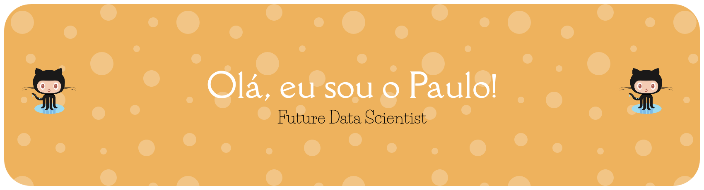

  

# Olá, eu sou o Paulo! 👋

### Engenheiro de Computação em formação | Aspirante a Cientista de Dados

Engenheiro de Computação mineiro, 26 anos, apaixonado por tecnologia e música. Atualmente focado em dominar o ecossistema Python e transformar dados em insights inteligentes.

---

## 🚀 Sobre mim
* 🐛 **Codificando:** Transformando café em código (e ocasionalmente criando uns bugs estratégicos).
* 📚 **Estudando:** Aprofundando conhecimentos em Python e Data Science.
* 🎯 **Objetivo:** Me tornar um Cientista de Dados de alto impacto.
* 🎧 **Hobby:** Não vivo sem uma boa playlist no Spotify enquanto dropo uns códigos.

## 🛠️ Tecnologias e Ferramentas

  
  
  

  

## 📫 Conecte-se comigo:

